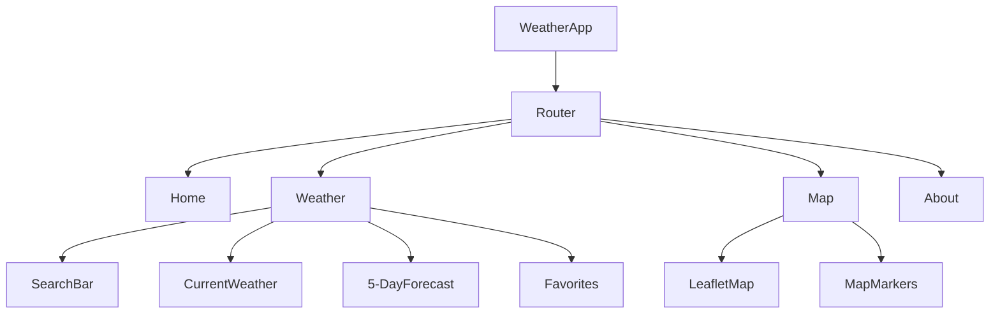

# PRA#03_React-EmmaAlonsoMcCoy-WeatherApp

## Overview

This document serves as a guide and log for the frontend development  of the WeatherApp project.

---

# Project Backlog

---

# ** Estimated Time for Tasks**

| Task                                       | Estimated Time | Actual Time | Impediments                                                                                                                                      | New Concepts                                                     |
| ------------------------------------------ | -------------- | ----------- | ------------------------------------------------------------------------------------------------------------------------------------------------ | ---------------------------------------------------------------- |
| Setup Git & README                         | 30 min         | 2 hours     | -                                                                                                                                                | -                                                                |
| Create `.gitignore` and `.env`             | 15 min         | 15 minutes  | -                                                                                                                                                | .env file                                                        |
| Study OpenWeather API                      | 1 hour         | 1 hour      | API limits? Built-in geolocation has been deprecated                                                                                             | Fetching JSON                                                    |
| Understanding useEffect for API Calls      | 45 min         | 45 min      | -                                                                                                                                                | Side effects <br/> Not efficient for event handlers like onClick |
| Understanding Mapping Arrays               | 15 min         | 15 min      | -                                                                                                                                                | Array methods                                                    |
| Define Component Tree                      | 30 min         | 30 min      | Had to redesign according to new tasks                                                                                                           | -                                                                |
| Create Wireframe                           | 1 hour         | 1:30 hour   | Had to redesign according to new tasks                                                                                                           | Excalidraw tool                                                  |
| Set up React Project Folders               | 30 min         | 30 min      | -                                                                                                                                                | -                                                                |
| Implement Router for multi-page navigation | 1 hour         | 2 hours     | Routing concept not understood properly                                                                                                          |                                                                  |
| Create Weather page                        |                |             |                                                                                                                                                  |                                                                  |
| Implement Search Component                 | 1 hours        | 1 hour      | -                                                                                                                                                | useState, onChange                                               |
| Implement Current Weather Display          | 2 hours        | 1 hour      | -                                                                                                                                                | API calls, useEffect                                             |
| Implement 5-Day Forecast Component         | 2 hours        | 1 hour      | -                                                                                                                                                | Mapping data                                                     |
| Implement Favourite Locations              | 1:30 hours     | 1 hour      | -                                                                                                                                                | Async/Await                                                      |
| Implement Map page                         | 1:30 hours     | 1:30 hours  | Obsolete styling conflict in Material UI (v5) caused by missing ThemeProvider, and ES modules error in Leaflet from incompatible require() usage | Error handling                                                   |
| Use Material UI for Styling                | 2 hours        | X           | -                                                                                                                                                | Component library                                                |
| **Total**                                  | **~16 hours**  | **X hours** | -                                                                                                                                                | Tasks                                                            |

---

# OpenWeather API Documentation

> This project will use the Built-in API request by city name. However, please note that [<u>built-in geocoder</u>](https://openweathermap.org/current#geocoding) has been deprecated. Although it is still available for use, bug fixing and updates are no longer available for this functionality.

### Authentication

To access OpenWeather API endpoints, you need an API key.

### Steps to Use the API Key:

1. Sign up at [OpenWeather](https://home.openweathermap.org/users/sign_up).

2. Verify your email and log in.

3. Navigate to "API keys" in your account settings.

4. Copy your generated API key.

5. Paste it in your .env file and make sure the .env file is included in your .gitignore
   
   ```properties
   VITE_OPEN_WEATHER_API_KEY=[your API key]
   ```

### Base URL

All API requests should be made to:

```
https://api.openweathermap.org/data/2.5/
```

## Endpoints

### 1. Current Weather Data

Fetch real-time weather conditions for a city. 

**Endpoint:**

```
GET /weather
```

**Query Parameters:**

| Parameter | Type   | Description                                                        |
| --------- | ------ | ------------------------------------------------------------------ |
| q         | string | City name (e.g., `q=London`).                                      |
| appid     | string | Your API key.                                                      |
| units     | string | Metric (`metric`), Imperial (`imperial`), or Standard (`default`). |

**Example Request:**

```
GET https://api.openweathermap.org/data/2.5/weather?q=London&appid=YOUR_API_KEY&units=metric
```

**Example Response:**

```json
{
   "coord": {
      "lon": 7.367,
      "lat": 45.133
   },
   "weather": [
      {
         "id": 501,
         "main": "Rain",
         "description": "moderate rain",
         "icon": "10d"
      }
   ],
   "base": "stations",
   "main": {
      "temp": 284.2,
      "feels_like": 282.93,
      "temp_min": 283.06,
      "temp_max": 286.82,
      "pressure": 1021,
      "humidity": 60,
      "sea_level": 1021,
      "grnd_level": 910
   },
   "visibility": 10000,
   "wind": {
      "speed": 4.09,
      "deg": 121,
      "gust": 3.47
   },
   "rain": {
      "1h": 2.73
   },
   "clouds": {
      "all": 83
   },
   "dt": 1726660758,
   "sys": {
      "type": 1,
      "id": 6736,
      "country": "IT",
      "sunrise": 1726636384,
      "sunset": 1726680975
   },
   "timezone": 7200,
   "id": 3165523,
   "name": "Province of Turin",
   "cod": 200
}                    
```

**JSON format API response fields**

- `coord`
  - `coord.lon` Longitude of the location
  - `coord.lat` Latitude of the location
- `weather` (more info [Weather condition codes](https://openweathermap.org/weather-conditions))
  - `weather.id` Weather condition id
  - `weather.main` Group of weather parameters (Rain, Snow, Clouds etc.)
  - `weather.description` Weather condition within the group. Please find more [here.](https://openweathermap.org/current#list) You can get the output in your language. [Learn more](https://openweathermap.org/current#multi)
  - `weather.icon` Weather icon id
- `base` Internal parameter
- `main`
  - `main.temp` Temperature. Unit Default: Kelvin, Metric: Celsius, Imperial: Fahrenheit
  - `main.feels_like` Temperature. This temperature parameter accounts for the human perception of weather. Unit Default: Kelvin, Metric: Celsius, Imperial: Fahrenheit
  - `main.pressure` Atmospheric pressure on the sea level, hPa
  - `main.humidity` Humidity, %
  - `main.temp_min` Minimum temperature at the moment. This is minimal currently observed temperature (within large megalopolises and urban areas). Please find more info [here.](https://openweathermap.org/current#min) Unit Default: Kelvin, Metric: Celsius, Imperial: Fahrenheit
  - `main.temp_max` Maximum temperature at the moment. This is maximal currently observed temperature (within large megalopolises and urban areas). Please find more info [here.](https://openweathermap.org/current#min) Unit Default: Kelvin, Metric: Celsius, Imperial: Fahrenheit
  - `main.sea_level` Atmospheric pressure on the sea level, hPa
  - `main.grnd_level` Atmospheric pressure on the ground level, hPa
- `visibility` Visibility, meter. The maximum value of the visibility is 10 km
- `wind`
  - `wind.speed` Wind speed. Unit Default: meter/sec, Metric: meter/sec, Imperial: miles/hour
  - `wind.deg` Wind direction, degrees (meteorological)
  - `wind.gust` Wind gust. Unit Default: meter/sec, Metric: meter/sec, Imperial: miles/hour
- `clouds`
  - `clouds.all` Cloudiness, %
- `rain`
  - `1h`(where available)Precipitation, mm/h. Please note that only mm/h as units of measurement are available for this parameter
- `snow`
  - `1h`(where available) Precipitation, mm/h. Please note that only mm/h as units of measurement are available for this parameter
- `dt` Time of data calculation, unix, UTC
- `sys`
  - `sys.type` Internal parameter
  - `sys.id` Internal parameter
  - `sys.message` Internal parameter
  - `sys.country` Country code (GB, JP etc.)
  - `sys.sunrise` Sunrise time, unix, UTC
  - `sys.sunset` Sunset time, unix, UTC
- `timezone` Shift in seconds from UTC
- `id` City ID. Please note that built-in geocoder functionality has been deprecated. Learn more [here](https://openweathermap.org/current#builtin)
- `name` City name. Please note that built-in geocoder functionality has been deprecated. Learn more [here](https://openweathermap.org/current#builtin)
- `cod` Internal parameter

---

### 2. 5-Day Forecast

Retrieve a forecast for the next 5 days at 3-hour intervals.

**Endpoint:**

```
GET /forecast
```

**Query Parameters:** (Same as Current Weather Data)

**Example Request:**

```
GET https://api.openweathermap.org/data/2.5/forecast?q=London&appid=YOUR_API_KEY&units=metric
```

---

## Response Codes

| Code | Meaning           |
| ---- | ----------------- |
| 200  | Success           |
| 401  | Invalid API key   |
| 404  | City not found    |
| 429  | Too many requests |

---

# Component Tree v1.0



---

# Wireframe (v1.0)


# Error Documentation and Solutions

### Error: `MUI: The 'styles' argument is invalid` & `ReferenceError: require is not defined`

**Corresponding Task:** Integrate Leaflet map with Material UI v5

**Description:** 

Two concurrent errors:

1. Material UI theme context missing due to deprecated `makeStyles` implementation

2. Leaflet icon imports failing due to CommonJS `require()` in ES modules environment

**Error Trace:**

- **Component:** `MapComponent`

- **File:** `MapComponent.jsx`

- **Line:** 19 (MUI error) | 20 (Leaflet error)

- **Stack Trace:**
  
  - `TypeError: theme.spacing is not a function`
  
  - `Uncaught ReferenceError: require is not defined`

**Possible Causes:**

1. Using legacy `@mui/styles` instead of modern Emotion/styled API

2. Missing ThemeProvider wrapper in parent components

3. Incorrect Leaflet asset loading in module bundlers (Vite/Webpack)

**Solution:**

```jsx
// Fixed Material UI implementation
import { styled } from '@mui/material/styles';

const MapContainerStyled = styled(MapContainer)(({ theme }) => ({
  height: "400px",
  width: "100%",
}));

// Fixed Leaflet imports
import markerIcon from 'leaflet/dist/images/marker-icon.png';
import markerShadow from 'leaflet/dist/images/marker-shadow.png';

// Icon configuration
delete L.Icon.Default.prototype._getIconUrl;
L.Icon.Default.mergeOptions({
  iconUrl: markerIcon,
  shadowUrl: markerShadow,
});

```

**Explanation:** 

1. **Material UI Fix:** Replaced deprecated `makeStyles` with `styled()` API to properly access theme context

2. **Leaflet Fix:** Converted CommonJS `require()` to ES module static imports and configured icon paths

3. **Bundler Compatibility:** Added file-loader/webpack aliases to handle Leaflet's PNG assets

---

## Future Improvements

- [ ] Improve **loading states** while fetching data

- [ ] Allow **temperature unit conversion (°C ⇄ °F)**

- [ ] Include **dark mode**

---
